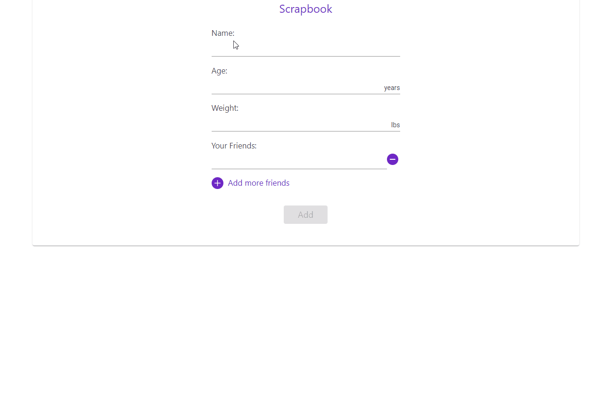

# Scrapbook

This project was generated with [Angular CLI](https://github.com/angular/angular-cli) version 9.1.12.

As a part of this exercise, I have created a form with the ability for the user to add their name, age, weight and list of friends they have. 

A user can add and remove any number of friends they want as part of the form. 

Upon submission, data are being displayed in a material table for the users to view what they entered, and it is also stored into the state. On refresh the users can view their previously added friends. 

Used NgRX for state management. Added pattern which can be scalable to add new actions and it's implementation.

Components are stateless.  

Used reactive forms for form validation.

Used BEM pattern for styling and it is fully responsive. 

## Scrapbook demo

#### Future Enhancements

Add D3 charts for data visualization.

## Development server

Run `ng serve` for a dev server. Navigate to `http://localhost:4200/`. The app will automatically reload if you change any of the source files.

## Code scaffolding

Run `ng generate component component-name` to generate a new component. You can also use `ng generate directive|pipe|service|class|guard|interface|enum|module`.

## Build

Run `ng build` to build the project. The build artifacts will be stored in the `dist/` directory. Use the `--prod` flag for a production build.

## Running unit tests

Run `ng test` to execute the unit tests via [Karma](https://karma-runner.github.io).

## Running end-to-end tests

Run `ng e2e` to execute the end-to-end tests via [Protractor](http://www.protractortest.org/).

## Further help

To get more help on the Angular CLI use `ng help` or go check out the [Angular CLI README](https://github.com/angular/angular-cli/blob/master/README.md).
